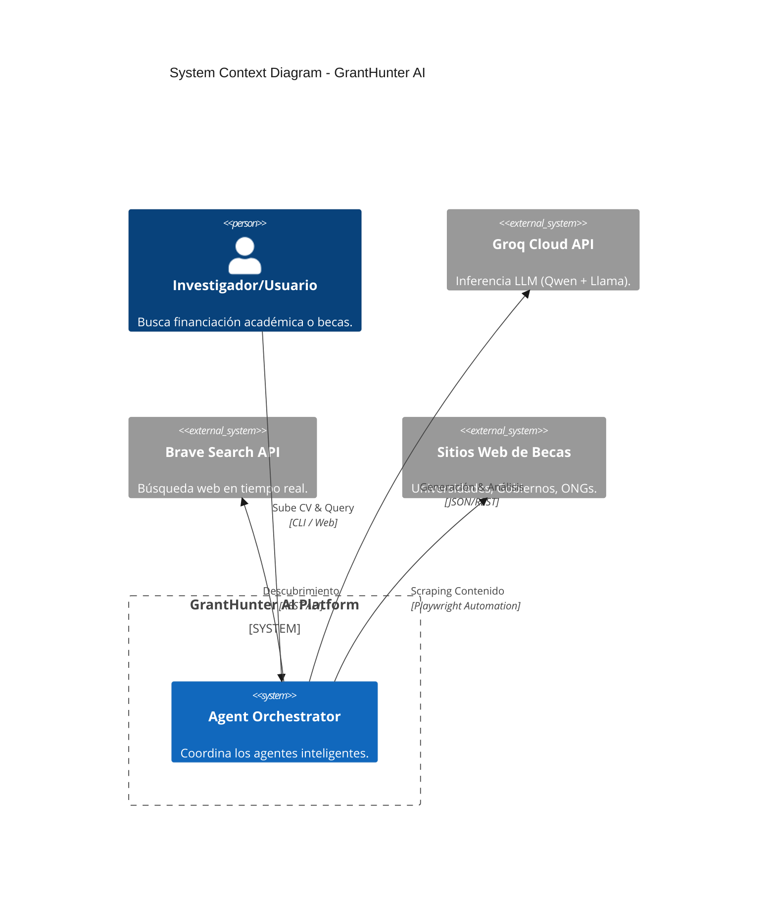
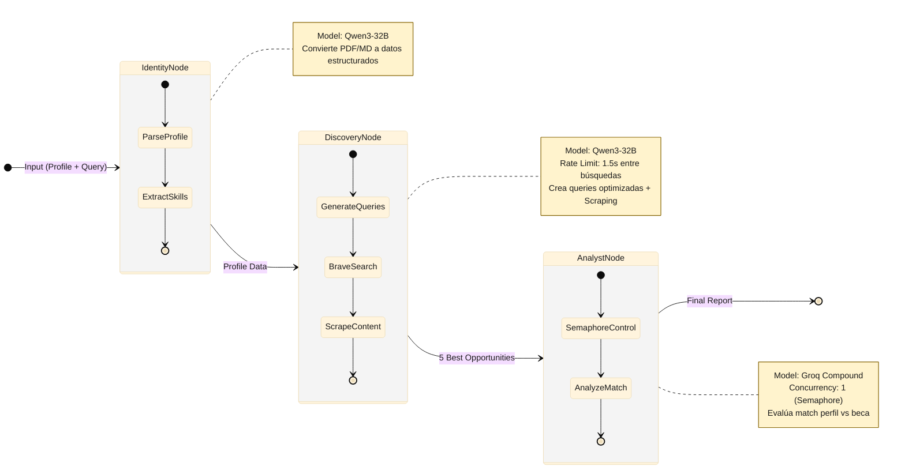
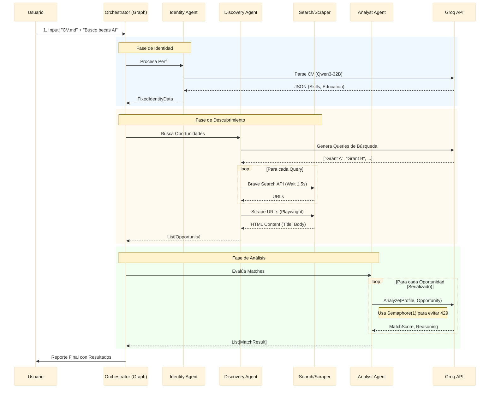
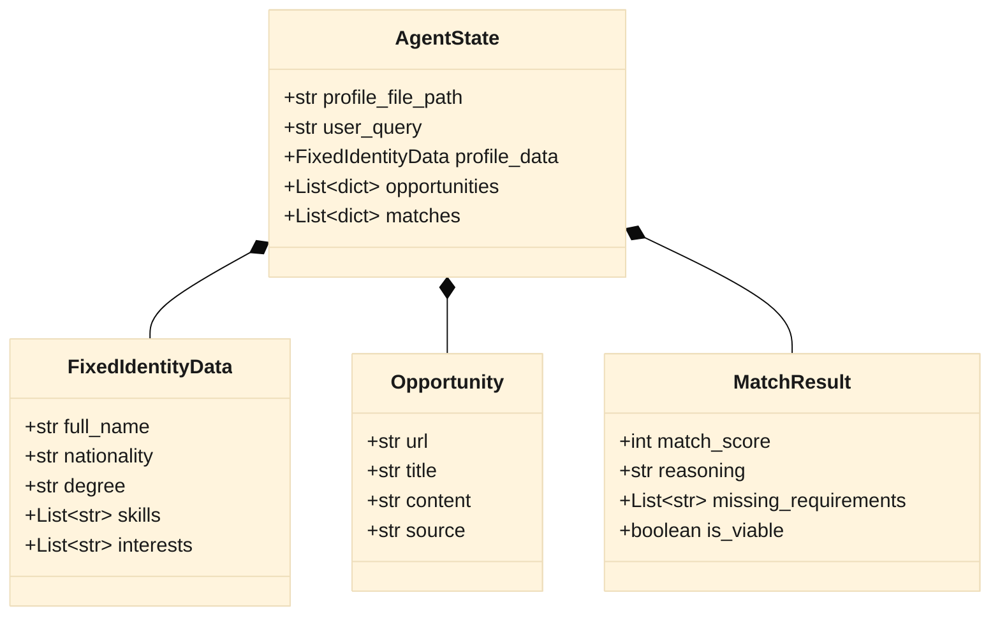
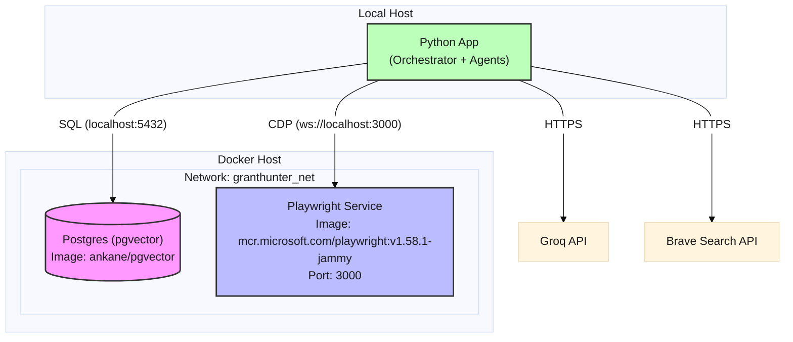

# 🏗️ GrantHunter AI - Architecture Design

> **Documentación Técnica Visual**
> Este documento detalla la arquitectura del sistema, flujos de datos y relaciones entre componentes utilizando diagramas visuales (Mermaid).

## 🔭 1. Visión General del Sistema (C4 Context)

Representación de alto nivel de cómo interactúa el Usuario con GrantHunter AI y los sistemas externos.

---

## 🧠 2. Flujo de Orquestación (LangGraph)

El "cerebro" del sistema es un grafo de estados que coordina tres agentes especializados.

---

## ⚡ 3. Diagrama de Secuencia de Ejecución

Detalle paso a paso de una ejecución típica de búsqueda de becas.

---

## 💾 4. Modelo de Datos (Data Dictionary)

Estructura de la información que fluye entre los agentes.

---

## 🏗️ 5. Infraestructura & Despliegue

Componentes físicos (Contenedores) del sistema local.

## 🧩 6. Tabla de Tecnologías

| Componente | Tecnología | Propósito |
| :--- | :--- | :--- |
| **Lenguaje** | Python 3.12 | Core logic |
| **Orquestación** | LangGraph | State management, ciclos |
| **LLM Inference** | Groq SDK | Inferencia ultra-rápida |
| **Modelos** | `llama-4-scout-17b-16e-instruct` | Todos los agentes (30k TPM, predecible) |
| **Token Tracking** | `response_metadata["token_usage"]` | Nativo Groq, sin dependencias extra |
| **Content Extraction** | `backend/utils/content_utils.py` | Prioriza párrafos con keywords de becas |
| **Navegador** | Playwright (Docker) | Scraping de sitios dinámicos (JS) |
| **Búsqueda** | Brave Search API | Privacidad + Índice independiente |
| **Base de Datos** | PostgreSQL + pgvector | (Futuro) Memoria a largo plazo |
